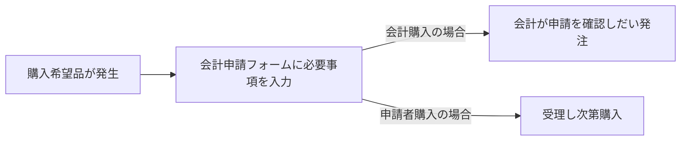

# 2023年会計関連
## はじめに
このリポジトリには2023年の会計申請所で使ったGASを用いたDiscordBot関連が置かれています。

## それぞれのファイルと関数の説明
### ChangeSpreadsheet.gs
- insertLastUpdated
  - スプレッドシート上で内容に変更があった際に最終更新日の欄を変更する関数
  - トリガー：「スプレッドシートから - 変更時」

### DiscordBot.gs
- SendFormDetail
  - フォームが送信された際に内容を取得し、ディスコードに内容を送る関数
  - トリガー：「スプレッドシートから - フォーム送信時」

- SendOnEdit
  - スプレッドシート上で内容変更があった際にディスコードに変更内容を送る関数
  - トリガー：「スプレッドシートから - 編集時」

## 実際の会計申請の流れ

